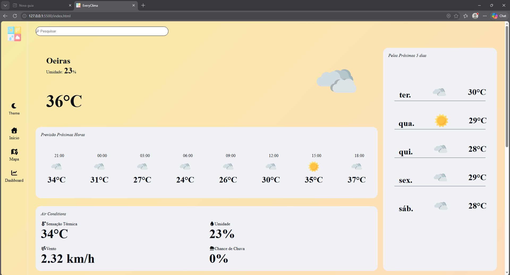

#  EveryClima

Sistema de previsão climática desenvolvido com HTML, CSS e JavaScript, utilizando a API OpenWeatherMap para fornecer informações meteorológicas em tempo real.

## ✨ Funcionalidades

- 🌡️ Temperatura atual da cidade pesquisada
- 💧 Umidade do ar
- 🌬️ Velocidade do vento
- ☁️ Condição climática atual
- 🕒 Previsão por hora
- 📅 Previsão para os próximos dias
- 🌙 Alternância entre tema claro e escuro
- 📱 Interface responsiva para dispositivos móveis e desktops

## 🛠️ Tecnologias Utilizadas

<div align="center">


</div>

## 📸 Demonstração

### Tema Claro


### Tema Escuro


## 🚀 Como Executar

1. Clone este repositório:

```bash
git clone https://github.com/seu-usuario/everyclima.git
